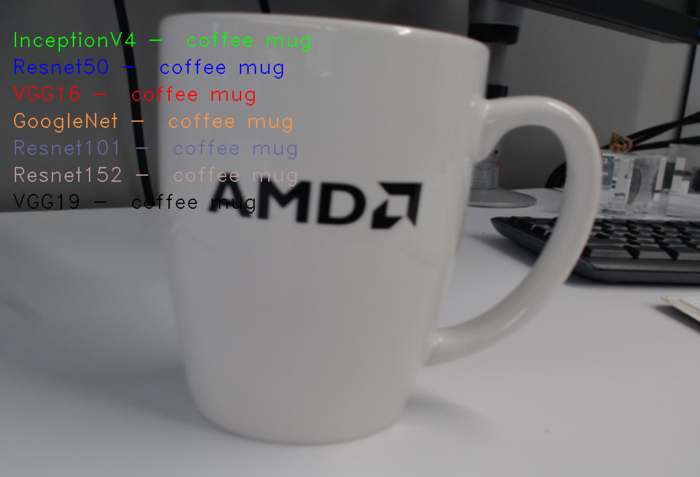

[](https://opensource.org/licenses/MIT)

# Live Image Classification

This application runs know CNN image classifiers on live/pre-recorded video stream.

## Usage
### Build
````
cmake .
make
````
### Run
```
Usage: ./classifier <inceptionV4 weights.bin> <resnet50 weights.bin> <vgg16 weights.bin> <googlenet weights.bin> <resnet101 weights.bin> <resnet152 weights.bin> <vgg19 weights.bin> 
[ --label <label text> --video <video file>/<--capture 0> ] 
```

#### weights.bin
Download or train your own caffemodel and run the [model_compiler](https://github.com/GPUOpen-ProfessionalCompute-Libraries/amdovx-modules/tree/develop/utils/model_compiler) to get the corresponding weights.bin file.

1. Download or train your own caffemodel.

Here is the sample download link that contains all the prototxt: 

https://github.com/SnailTyan/caffe-model-zoo

2. Using model compiler

To convert a caffemodel into AMD NNIR model:
```
% python caffe2nnir.py <net.caffeModel> <nnirOutputFolder> --input-dims n,c,h,w [--verbose 0|1]
```

To convert an AMD NNIR model into OpenVX C code:

````
% python nnir2openvx.py <nnirInputFolder> <outputFolder>
````
The weights file will be generated and you can use that as an input for this project.

#### --label text

The labels.txt file in this project.
  
#### --video file
Test the classification on your own video. Give the path to your video.
  
#### --capture 0
If you want to test with a live cam, turn on this option.

### Example
```
./classifier /PATH/TO/inceptionV4/weights.bin /PATH/TO/resnet50/weights.bin /PATH/TO/vgg16/weights.bin ... 
.../PATH/TO/vgg19/weights.bin --label labels.txt --capture 0
```
# MIVisionX Image Classification Control
[](https://github.com/kiritigowda/MIVisionX-setup) 

# MIVisionX Image Classification
[](https://github.com/kiritigowda/MIVisionX-setup) 
